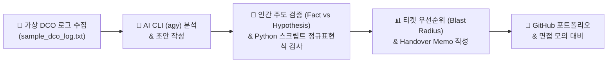

<div align="center">

# ☁️ AWS DCO GenAI Portfolio

### **AWS Data Center Operations (DCO) 인턴십 대비 생성형 AI 활용 & 인프라 엔지니어링 포트폴리오**

[](https://aws.amazon.com)
[](https://python.org)
[](https://git-scm.com)
[](#-3-ai-cli-agy-검증-회고-human-in-the-loop)
[](#)

<p align="center">
  <b>비전공자(분자생물학 전공) ➔ IT Data Center Operations 인프라 엔지니어</b><br>
  생성형 AI(Antigravity CLI <code>agy</code>)를 페어 파트너로 활용하여 로그 파싱, 장애 분석, Incident Report 작성,<br>
  Ticket Triage 및 Shift Handover 실습을 수행한 검증 중심의 포트폴리오입니다.
</p>

---

</div>

<br>

> [!IMPORTANT]
> **Human-in-the-Loop (인간 주도 검증) 원칙**
> 
> 본 포트폴리오는 **"AI의 생성 결과는 최종 정답이 아닌 검토 대상 초안"**이라는 원칙을 엄격히 준수합니다. AI가 제시한 장애 분석 및 보고서 초안에서 **확인된 사실(Fact)**과 **가능한 추정(Hypothesis)**을 직접 1:1 대조·분리하고, 환각(Hallucination) 및 원인 단정 오류를 파이썬 자동 검증 프로그램으로 교정한 실습 기록입니다.

<br>

## 📌 1. 포트폴리오 핵심 학습 철학



<br>

| 핵심 가치 | 상세 실행 내용 |
| :--- | :--- |
| **🔍 Fact vs Hypothesis 분리** | AI 보고서 초안에서 확인된 사실과 미확인 가설을 엄격히 구분 (`[사실]`, `[추정]`, `[미확인]`) |
| **🛠️ 도메인 실무 언어 체득** | PDU, UPS, N+1 이중화, ToR Switch, Link Flap, CRC error, SFP 트랜시버, DOM 광파워 지식 습득 |
| **⚡ 비즈니스 영향도 (Blast Radius)** | 단순 알람 심각도(Severity)가 아닌 실제 가용성, 이중화 상태(Feed B, Mirroring), 영향 서버 수 기반 우선순위 산정 |

<br>

---

## 📂 2. 저장소 구조 및 차시별 산출물 맵

| 차시 / 폴더 | 핵심 역할 및 엔지니어링 실습 내용 | 대표 산출물 링크 |
| :--- | :--- | :--- |
| **01_dco_glossary** | **DCO 인프라 용어집**: PDU, UPS, N+1 이중화, ToR Switch, CRC error 등 인프라 용어 정리 | 📄 [`dco_glossary.md`](file:///C:/Users/admin_23/Desktop/AWS-DCO-GenAI-Portfolio/01_dco_glossary) |
| **02_dco_profile** | **협업 역량 분석**: 강점(분석적 사고)을 Ticket, SOP, SLA, Escalation 절차와 연계해 서술 | 📄 [`dco_profile.md`](file:///C:/Users/admin_23/Desktop/AWS-DCO-GenAI-Portfolio/02_dco_profile) |
| **03_sop_analysis** | **SOP 분석 & 체크리스트**: 가상의 SOP 절차서를 조치 단계별 현장 점검표로 재구성 | 📋 [`sop_checklist.md`](file:///C:/Users/admin_23/Desktop/AWS-DCO-GenAI-Portfolio/03_sop_analysis/sop_checklist.md) |
| **03_star_interview** | **STAR 면접 대비**: Amazon Leadership Principles 연계 30초 자기소개 및 문제 해결 사례 | 🎤 [`star_interview.md`](file:///C:/Users/admin_23/Desktop/AWS-DCO-GenAI-Portfolio/03_star_interview) |
| **04_environment_setup**| **환경 구축**: Git/GitHub, Python 3.11+, CLI 자동화 도구 환경 설정 기록 | 🛠️ [`setup_guide.md`](file:///C:/Users/admin_23/Desktop/AWS-DCO-GenAI-Portfolio/04_environment_setup) |
| **05_antigravity_cli** | **AI CLI 활용**: Antigravity CLI (`agy`) 프롬프트 명령 체계 학습 및 검증 | 🤖 [`agy_cli_check.md`](file:///C:/Users/admin_23/Desktop/AWS-DCO-GenAI-Portfolio/05_antigravity_cli/agy_cli_check.md) |
| **06_cli_file_automation**| **파일 자동화**: CLI 스크립트를 활용한 랙 점검표 및 티켓 템플릿 자동 생성 | 📝 [`rack_checklist.md`](file:///C:/Users/admin_23/Desktop/AWS-DCO-GenAI-Portfolio/06_cli_file_automation/rack_checklist.md) |
| **07 & 09_log_analysis** | **로그 파싱 파이프라인**: 140줄 DCO 가상 로그 자동 분류 스크립트 작성 및 이상 징후 집계 | 🐍 [`analyze_logs.py`](file:///C:/Users/admin_23/Desktop/AWS-DCO-GenAI-Portfolio/09_log_analysis_script/analyze_logs.py)<br>📊 [`incident_summary.md`](file:///C:/Users/admin_23/Desktop/AWS-DCO-GenAI-Portfolio/09_log_analysis_script/incident_summary.md) |
| **10_incident_analysis** | **장애 심층 분석**: CRC Error 및 Link Down 장애에 대한 복수 원인 가설(케이블, 커넥터, SFP) 수립 | 🔍 [`crc_Iinkdown_analysis.md`](file:///C:/Users/admin_23/Desktop/AWS-DCO-GenAI-Portfolio/10_incident_analysis/crc_Iinkdown_analysis.md) |
| **11_incident_report** | **보고서 & 검증 스크립트**: 11개 구조 Incident Report, Python 자동 검증기, 1분 브리핑 서식 | 📑 [`dco_incident_report.md`](file:///C:/Users/admin_23/Desktop/AWS-DCO-GenAI-Portfolio/11_incident_report/dco_incident_report.md)<br>⚡ [`check_incident_report.py`](file:///C:/Users/admin_23/Desktop/AWS-DCO-GenAI-Portfolio/11_incident_report/check_incident_report.py) |
| **12_ticket_triage** | **티켓 트리아지 & 인수인계**: 4개 티켓 복수 장애 발생 시 Blast Radius 기준 우선순위 및 Handover | 🎯 [`ticket_priority_matrix.csv`](file:///C:/Users/admin_23/Desktop/AWS-DCO-GenAI-Portfolio/12_ticket_triage_handover/ticket_priority_matrix.csv)<br>⏱️ [`shift_handover.md`](file:///C:/Users/admin_23/Desktop/AWS-DCO-GenAI-Portfolio/12_ticket_triage_handover/shift_handover.md) |
| **CAREER_JOB_PREP** | **취업 준비 프로젝트**: DCO 채용공고 분석, 경험-역량 매칭, STAR 경험카드 5종, AI 모의면접 서식 | 💼 [`CAREER_JOB_PREP.md`](file:///C:/Users/admin_23/Desktop/AWS-DCO-GenAI-Portfolio/CAREER_JOB_PREP.md) |

<br>

---

## 🔍 3. AI CLI (`agy`) 검증 회고 (Human-in-the-Loop Matrix)

> [!NOTE]
> **실체적 교정 사례: AI 생성 초안의 한계와 엔지니어의 수동 교정**

| 구분 | 🤖 AI 생성 결과의 한계 | 🔬 엔지니어 직접 검증 & 교정 내용 |
| :--- | :--- | :--- |
| **1. 비즈니스 리스크 평가** | 단순 `ERROR` / `WARNING` 심각도 문구와 발생 시간에 의존하여 우선순위를 기계적으로 정렬 | 실제 서버 2대 연결 차단(Actual Outage)이 발생한 `EDU-TKT-2026-0201`(포트 장애)과 Feed B 이중화로 가용성이 유지된 `EDU-TKT-2026-0202`(PDU 경고)의 **가용성 임팩트 차이**를 정밀 가중치로 반영 |
| **2. 간헐적 장애 (Flapping)** | 06:48 `LINK_UP` 로그 발생만을 이유로 해당 인시던트를 단순 "복구 완료"로 단락화 | 07:05 `LINK_FLAP_DETECTED`가 1회 추가 기록된 **간헐적 장애 재발 상태**를 포착하여 1순위 관리 대상으로 교정 |
| **3. Action Item 구체성** | "원인 미확인" 항목을 단순 텍스트 나열 수준으로 정리 | 현장 엔지니어가 점검해야 할 **구체적 실계측 항목**(DOM 광파워 모니터링 수치, 시설팀 PDU 전압 측정값)을 도출 |
| **4. 근본 원인 (Root Cause)** | 수리 로그(케이블 교체/세척)를 보고 근본 원인을 광케이블 불량으로 단정(Assertive) | 현장 수거 자재 측정 및 광파워 대조 전까지는 단정할 수 없으므로 **가설(Hypothesis)** 단계로 명확히 분리 |

<br>

---

## 🤖 4. 생성형 AI 활용 원칙 & 학습 성과 대시보드

### 🛡️ 생성형 AI 활용 7대 원칙

```text
[원칙 1] AI 초안검토   : 생성형 AI 답변은 최종 정답이 아닌 검토용 초안으로 활용
[원칙 2] 1:1 원본대조  : AI 생성 장비명, 타임스탬프, Ticket ID를 원본 로그와 대조
[원칙 3] Fact/Hypo 분리 : 확인된 사실(Fact)과 가능한 추정(Hypothesis)을 엄격히 구분
[원칙 4] 원인 단정 금지 : 미확인 근본 원인(Root Cause)을 임의로 확정하지 않음
[원칙 5] 주체적 트리아지: Ticket 우선순위는 AI가 아닌 엔지니어가 영향도 기반으로 최종 판단
[원칙 6] 보안 준수     : 실제 계정, 실제 장비 정보, AWS 내부 데이터를 입력하지 않음
[원칙 7] 가상 데이터   : 모든 테스트 데이터는 SAMPLE/DEMO/EDU 교육용 데이터로만 구성
```

<br>

### 🎯 핵심 학습 성과 (Learnings & Takeaways)

> [!TIP]
> **실습을 통해 체득한 8가지 핵심엔지니어링 역량**

```
 1. ⚡ [생산성 향상]   AI를 활용한 로그 파싱 및 incident report 작성 시간 80% 단축
 2. 🔬 [품질 검증]     Python 정규표현식 검증 스크립트로 AI 환각(Hallucination) 차단
 3. 🧩 [로그 3분할]    Fact / Hypothesis / Missing Data의 3단 파이프라인 체계 구축
 4. 🔄 [복구 ≠ 원인]   Link Up 복구가 근본 원인(Root Cause) 해결을 의미하지 않음을 체득
 5. 📊 [Severity≠Priority] 심각도(Severity)와 엔지니어링 처리 순서(Priority)의 명확한 구별
 6. 🎯 [Blast Radius]  영향 서버 수, 전원 이중화(Feed B), 지속성을 결합한 티켓 트리아지
 7. ⏱️ [Handover 전달] Incident Report(경과 공유)와 Shift Handover(Action Item 전달) 분리
 8. 📝 [과정의 가치]   기술 결과물뿐만 아니라 검증 과정(Human-in-the-Loop) 투명 기록
```

<br>

---

## 💼 5. 취업 준비 경험 카드 5종 대시보드 (`CAREER_JOB_PREP.md`)

[](file:///C:/Users/admin_23/Desktop/AWS-DCO-GenAI-Portfolio/CAREER_JOB_PREP.md)

| 경험 카드 | 핵심 활동 및 성과 | 연결 직무 역량 | 증거 자재 링크 |
| :---: | :--- | :---: | :---: |
| **🎴 경험 1<br>(로그 파싱)** | 140줄 DCO 가상 로그 심각도별 자동 분류 및 이상 징후 요약 스크립트 작성 | Python 자동화<br>로그 분석 | 🐍 [`analyze_logs.py`](file:///C:/Users/admin_23/Desktop/AWS-DCO-GenAI-Portfolio/09_log_analysis_script/analyze_logs.py) |
| **🎴 경험 2<br>(장애 검증)** | 포트 장애 보고서 작성 및 Python 기반 7가지 규격 자동 검증 스크립트 개발 | Incident Report<br>코드 품질 검증 | ⚡ [`check_incident_report.py`](file:///C:/Users/admin_23/Desktop/AWS-DCO-GenAI-Portfolio/11_incident_report/check_incident_report.py) |
| **🎴 경험 3<br>(SOP 분석)** | 가상 SOP 표준 운영 절차서를 조치 단계별 랙/장비 점검 체크리스트로 재구성 | SOP 분석 & 준수<br>문서 구조화 | 📋 [`sop_checklist.md`](file:///C:/Users/admin_23/Desktop/AWS-DCO-GenAI-Portfolio/03_sop_analysis/sop_checklist.md) |
| **🎴 경험 4<br>(티켓 트리아지)**| Blast Radius 기준 4개 복수 장애 티켓 우선순위 산정 및 Handover Memo 작성 | Ticket Triage<br>Shift Handover | ⏱️ [`shift_handover.md`](file:///C:/Users/admin_23/Desktop/AWS-DCO-GenAI-Portfolio/12_ticket_triage_handover/shift_handover.md) |
| **🎴 경험 5<br>(AI 페어링)** | Git/GitHub 프로젝트 버전 관리 및 AI 초안 검증/교정 프로세스 기록 | Git 버전 관리<br>AI 페어프로그래밍 | 📘 [`README.md`](file:///C:/Users/admin_23/Desktop/AWS-DCO-GenAI-Portfolio/README.md) |

<br>

---

## 🔒 6. 보안 및 교육용 데이터 사용 준수 안내

> [!CAUTION]
> **Security & Educational Compliance Notice**
> 
> - **가상 데이터 적용**: 모든 시스템명, IP 주소, 티켓 ID는 `SAMPLE_TOR_SW_03`, `EDU-TKT-2026-0201`, `192.0.2.1` 등 가상의 서식으로 관리됩니다.
> - **보안 민감 정보 제외**: 실제 데이터센터 장비 조작 명령어나 비밀번호, API Key 등 민감 정보는 일체 포함되어 있지 않으며 `.gitignore`로 관리됩니다.
> - **학습 목적 안내**: 본 저장소는 AWS DCO 직무 이해 및 인프라 운영 논리 체득을 목적으로 한 개인 학습용 포트폴리오입니다.

<br>

---

<div align="center">

**AWS-DCO-GenAI-Portfolio** • Created & Maintained by DCO Aspirant (Polytech Academy)<br>
*Copyright © 2026 All Rights Reserved.*

</div>
