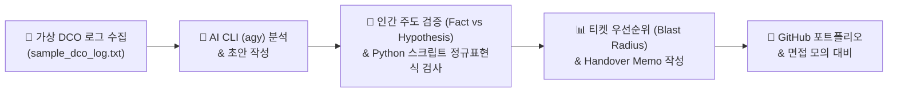

# ☁️ AWS DCO GenAI Portfolio

### **AWS Data Center Operations (DCO) 인턴십 대비 생성형 AI 활용 & 인프라 엔지니어링 포트폴리오**

  <b>비전공자(분자생물학 전공) ➔ IT Data Center Operations 인프라 엔지니어</b> 
  생성형 AI(Antigravity CLI <code>agy</code>)를 페어 파트너로 활용하여 로그 파싱, 장애 분석, Incident Report 작성, 
  Ticket Triage 및 Shift Handover 실습을 수행한 검증 중심의 포트폴리오입니다.

---

 

> [!IMPORTANT]
> **Human-in-the-Loop (인간 주도 검증) 원칙**
> 
> 본 포트폴리오는 **"AI의 생성 결과는 최종 정답이 아닌 검토 대상 초안"**이라는 원칙을 엄격히 준수합니다. AI가 제시한 장애 분석 및 보고서 초안에서 **확인된 사실(Fact)**과 **가능한 추정(Hypothesis)**을 직접 1:1 대조·분리하고, 환각(Hallucination) 및 원인 단정 오류를 파이썬 자동 검증 프로그램으로 교정한 실습 기록입니다.

 

## 📌 1. 포트폴리오 핵심 학습 철학

1. **AI 초안 ➔ 엔지니어 검증 ➔ 파이썬 자동 검사 체계 구축**
   - AI가 작성한 보고서 문맥에서 근본 원인(Root Cause)을 임의로 단정 짓는 표현을 차단하고, `[사실]`, `[추정]`, `[미확인]` 태그로 구분하였습니다.
2. **현장 실무 중심 도메인 지식 체득**
   - PDU 입력 전압, UPS 이중화, ToR Switch, Link Flap, CRC error, SFP 트랜시버, DOM 광파워 등 데이터센터 인프라 현장 핵심 지식을 직접 다루었습니다.
3. **가용성(Availability) 및 비즈니스 영향도(Blast Radius) 중심 결정**
   - 단순 로그 알람 수위(ERROR/WARNING)에 휩쓸리지 않고, 서비스 장애 여부, 이중화 가동 상태(Feed B, Mirroring), 영향 서버 수 수치를 기반으로 Ticket 우선순위(Priority)를 결정했습니다.

 

---

## 📂 2. 저장소 구조 및 차시별 산출물 맵

| 차시 / 폴더 | 핵심 역할 및 엔지니어링 실습 내용 | 대표 산출물 링크 |
| :--- | :--- | :--- |
| **01_dco_glossary** | **DCO 인프라 용어집**: PDU, UPS, N+1 이중화, ToR Switch, CRC error 등 인프라 용어 정리 | 📄 [`dco_glossary.md`](file:///C:/Users/admin_23/Desktop/AWS-DCO-GenAI-Portfolio/01_dco_glossary) |
| **02_dco_profile** | **협업 역량 분석**: 강점(분석적 사고)을 Ticket, SOP, SLA, Escalation 절차와 연계해 서술 | 📄 [`dco_profile.md`](file:///C:/Users/admin_23/Desktop/AWS-DCO-GenAI-Portfolio/02_dco_profile) |
| **03_sop_analysis** | **SOP 분석 & 체크리스트**: 가상의 SOP 절차서를 조치 단계별 현장 점검표로 재구성 | 📋 [`sop_checklist.md`](file:///C:/Users/admin_23/Desktop/AWS-DCO-GenAI-Portfolio/03_sop_analysis/sop_checklist.md) |
| **03_star_interview** | **STAR 면접 대비**: Amazon Leadership Principles 연계 30초 자기소개 및 문제 해결 사례 | 🎤 [`star_interview.md`](file:///C:/Users/admin_23/Desktop/AWS-DCO-GenAI-Portfolio/03_star_interview) |
| **04_environment_setup**| **환경 구축**: Git/GitHub, Python 3.11+, CLI 자동화 도구 환경 설정 기록 | 🛠️ [`setup_guide.md`](file:///C:/Users/admin_23/Desktop/AWS-DCO-GenAI-Portfolio/04_environment_setup) |
| **05_antigravity_cli** | **AI CLI 활용**: Antigravity CLI (`agy`) 프롬프트 명령 체계 학습 및 검증 | 🤖 [`agy_cli_check.md`](file:///C:/Users/admin_23/Desktop/AWS-DCO-GenAI-Portfolio/05_antigravity_cli/agy_cli_check.md) |
| **06_cli_file_automation**| **파일 자동화**: CLI 스크립트를 활용한 랙 점검표 및 티켓 템플릿 자동 생성 | 📝 [`rack_checklist.md`](file:///C:/Users/admin_23/Desktop/AWS-DCO-GenAI-Portfolio/06_cli_file_automation/rack_checklist.md) |
| **07 & 09_log_analysis** | **로그 파싱 파이프라인**: 140줄 DCO 가상 로그 자동 분류 스크립트 작성 및 이상 징후 집계 | 🐍 [`analyze_logs.py`](file:///C:/Users/admin_23/Desktop/AWS-DCO-GenAI-Portfolio/09_log_analysis_script/analyze_logs.py) 📊 [`incident_summary.md`](file:///C:/Users/admin_23/Desktop/AWS-DCO-GenAI-Portfolio/09_log_analysis_script/incident_summary.md) |
| **10_incident_analysis** | **장애 심층 분석**: CRC Error 및 Link Down 장애에 대한 복수 원인 가설(케이블, 커넥터, SFP) 수립 | 🔍 [`crc_Iinkdown_analysis.md`](file:///C:/Users/admin_23/Desktop/AWS-DCO-GenAI-Portfolio/10_incident_analysis/crc_Iinkdown_analysis.md) |
| **11_incident_report** | **보고서 & 검증 스크립트**: 11개 구조 Incident Report, Python 자동 검증기, 1분 브리핑 서식 | 📑 [`dco_incident_report.md`](file:///C:/Users/admin_23/Desktop/AWS-DCO-GenAI-Portfolio/11_incident_report/dco_incident_report.md) ⚡ [`check_incident_report.py`](file:///C:/Users/admin_23/Desktop/AWS-DCO-GenAI-Portfolio/11_incident_report/check_incident_report.py) |
| **12_ticket_triage** | **티켓 트리아지 & 인수인계**: 4개 티켓 복수 장애 발생 시 Blast Radius 기준 우선순위 및 Handover | 🎯 [`ticket_priority_matrix.csv`](file:///C:/Users/admin_23/Desktop/AWS-DCO-GenAI-Portfolio/12_ticket_triage_handover/ticket_priority_matrix.csv) ⏱️ [`shift_handover.md`](file:///C:/Users/admin_23/Desktop/AWS-DCO-GenAI-Portfolio/12_ticket_triage_handover/shift_handover.md) |
| **CAREER_JOB_PREP** | **취업 준비 프로젝트**: DCO 채용공고 분석, 경험-역량 매칭, STAR 경험카드 5종, AI 모의면접 서식 | 💼 [`CAREER_JOB_PREP.md`](file:///C:/Users/admin_23/Desktop/AWS-DCO-GenAI-Portfolio/CAREER_JOB_PREP.md) |

 

---

## 🔍 3. AI(Antigravity CLI `agy`) 활용 & 검증 회고

> [!NOTE]
> **실체적 회고: AI 도구를 사용하며 무엇을 발견하고 교정했는가?**

#### 1) 사용한 도구
- **Antigravity CLI (`agy`)**

#### 2) AI 생성 내용 중 발견한 오류 및 부족한 점
- **단순 Severity 및 타임스탬프 추종 문제**: AI는 `ERROR` / `WARNING` 심각도 라벨에 의존하여, 실제 서버 2대 차단(Actual Outage)이 발생한 `EDU-TKT-2026-0201`(포트 장애)과 Feed B 이중화로 영향이 없었던 `EDU-TKT-2026-0202`(PDU 경고)의 **실제 가용성 비즈니스 임팩트 차이**를 제대로 가중치 부여하지 못함.
- **복구 후 간헐적 재발(Link Flap) 저평가**: 06:48 `LINK_UP` 이후 07:05 `LINK_FLAP_DETECTED`가 1회 추가 기록된 **간헐적 장애 재발 상태**를 단순 "복구 완료"로 축약하는 오류가 발생함.
- **구체적 Action Item 부재**: "원인 미확인"을 텍스트로만 나열하고 현장 엔지니어가 확인해야 할 실계측 데이터(DOM 광파워, 시설팀 전압 측정값) 조치를 도출하지 못함.

#### 3) AI 결과에서 원본 자료와 다르거나 설명이 부족했던 부분
- **이중화(Redundancy) 맥락 오인**: PDU 경고 시 `Feed B` 동작 및 SSD 경고 시 `Storage Mirror` 가동 상태를 구분하지 않고 장애 상황처럼 단락화함.
- **영향 범위(Blast Radius) 정량화 미비**: 영향 서버 2대 vs 영향 가능 서버 6대의 수치적 범위를 우선순위 판단 근거로 체계적으로 연계하지 못해 엔지니어가 직접 판단 보완함.
- **원인 단정(Root Cause Assertive) 경향**: 조치 결과를 바탕으로 근본 원인을 확정하려 했으나, 파이버 꺾임이나 오염 등은 현장 수거 검사 전까지 **가설(Hypothesis)**로 남겨두어야 함을 직접 재검토함.

 

---

## 🤖 4. 생성형 AI 활용 원칙 & 실습 학습 성과

<b>💡 생성형 AI 활용 원칙 (Generative AI Principles) 보기 (클릭)</b>

- **초안 검토 원칙**: 생성형 AI의 답변은 최종 정답이 아니라 검토가 필요한 초안으로 사용했습니다.
- **원본 로그 비교**: AI가 작성한 장비명, 시간, Ticket ID와 사건 내용을 원본 로그와 1:1로 직접 대조하고 비교했습니다.
- **사실과 추정의 분리**: 로그에서 직접 확인되는 사실(Fact)과 가능한 추정/가설(Hypothesis)을 엄격하게 구분했습니다.
- **근본 원인 확정 금지**: 로그만으로 확인할 수 없는 근본 원인(Root Cause)은 임의로 확정하지 않았습니다.
- **주체적 우선순위 판단**: Ticket 우선순위는 AI가 대신 결정하지 않고, 엔지니어가 비즈니스 영향도와 근거를 비교하여 직접 판단했습니다.
- **보안 가이드라인 준수**: 실제 계정 정보, 실제 장비 정보, 실제 Ticket과 실제 AWS 내부 정보를 AI에 입력하지 않았습니다.
- **교육용 데이터 구성**: 모든 로그, 장비명, Ticket ID와 IP 주소는 공개 학습용 샘플 데이터로 구성했습니다.

<b>🎯 실제 실습을 통해 배운 점 (Learnings & Takeaways) 보기 (클릭)</b>

1. **생성형 AI의 생산성과 파이프라인 가속화**: 생성형 AI를 활용하면 로그 요약, Python 코드 작성과 Incident Report 초안 작성 시간을 획기적으로 줄일 수 있습니다.
2. **인간 주도 검증(Human-in-the-Loop)의 필수성**: AI가 빠르게 결과를 생성하더라도 원본 자료와 비교하는 검증 과정이 반드시 필요함을 실감했습니다.
3. **로그 분석 시 3가지 요소의 명확한 구분**: 로그 분석에서는 **확인된 사실(Fact)**, **가능한 추정(Hypothesis)**과 **미확인 정보(Missing Info)**를 명확히 구분해야 합니다.
4. **복구(Recovery)와 근본 원인(Root Cause)의 독립성**: 장애가 복구되었다는 사실만으로 정확한 Root Cause가 확인된 것은 아니며, 재발 가능성에 대한 모니터링이 이어져야 함을 배웠습니다.
5. **Severity와 Priority의 체계적 차이**: `Severity`는 사건의 기술적 심각도이고, `Priority`는 "무엇을 먼저 확인할 것인지" 정한 엔지니어링 처리 순서입니다.
6. **다각적 Ticket 우선순위 결정 기준**: Ticket 우선순위는 서비스 영향, 반복·지속 여부, 영향 범위(Blast Radius), 복구 여부와 현재 상태를 함께 종합적으로 고려해야 합니다.
7. **Incident Report와 Handover Memo의 목적**: Incident Report는 사건의 흐름과 조치 결과를 체계적으로 공유하기 위함이며, Handover Memo는 교대 전에 진행 중인 상황과 차기 확인 사항을 다음 담당자에게 명확히 전달하기 위해 작성합니다.
8. **과정(Process) 중심 기록의 기술 가치**: 단순 기술 결과물뿐만 아니라 **AI를 어떤 목적으로 사용하고, 무엇을 직접 검증하고 수정했는지**를 투명하게 기록하는 것이 엔지니어로서의 진정한 역량입니다.

 

---

## 💼 5. 취업 준비 경험 카드 & 모의 면접 대비 (`CAREER_JOB_PREP.md`)

[`CAREER_JOB_PREP.md`](file:///C:/Users/admin_23/Desktop/AWS-DCO-GenAI-Portfolio/CAREER_JOB_PREP.md) 문서에 정리된 DCO 인턴 및 인프라 운영 지원 맞춤형 경험 카드 5종 요약:

- 🎴 **경험 1 [Python 파이프라인]**: 140줄 DCO 가상 로그 파싱 및 이상 징후 요약 스크립트 작성 (`analyze_logs.py`)
- 🎴 **경험 2 [품질 검증 서식]**: Incident Report 작성 및 Python 기반 7가지 항목 자동 검증기 개발 (`check_incident_report.py`)
- 🎴 **경험 3 [SOP 문서화]**: 교육용 SOP 분석 및 랙/인프라 현장 점검 체크리스트 변환 (`sop_checklist.md`)
- 🎴 **경험 4 [티켓 트리아지]**: Blast Radius 중심 복수 장애 티켓 우선순위 판단 및 Handover Memo 작성 (`shift_handover.md`)
- 🎴 **경험 5 [AI 페어프로그래밍]**: Git/GitHub 프로젝트 버전 관리 및 AI 초안 교정 프로세스 기록 (`README.md`)

 

---

## 🔒 6. 보안 및 교육용 데이터 사용 준수 안내

> [!WARNING]
> **Educational Disclaimer & Security Notice**
> 
> - 저장소 내 모든 시스템명, IP 주소, 티켓 ID는 `SAMPLE_TOR_SW_03`, `EDU-TKT-2026-0201`, `192.0.2.1` 등 가상의 서식으로 변경되어 있습니다.
> - 실제 데이터센터 장비 조작 명령어나 비밀번호, API Key 등 보안 민감 파일은 포함되어 있지 않으며 `.gitignore`를 통해 엄격히 관리됩니다.
> - 본 저장소는 AWS DCO 직무 이해 및 인프라 운영 논리 체득을 목적으로 한 개인 학습용 포트폴리오입니다.

 

---

**AWS-DCO-GenAI-Portfolio** • Created & Maintained by DCO Aspirant (Polytech Academy) 
*Copyright © 2026 All Rights Reserved.*

